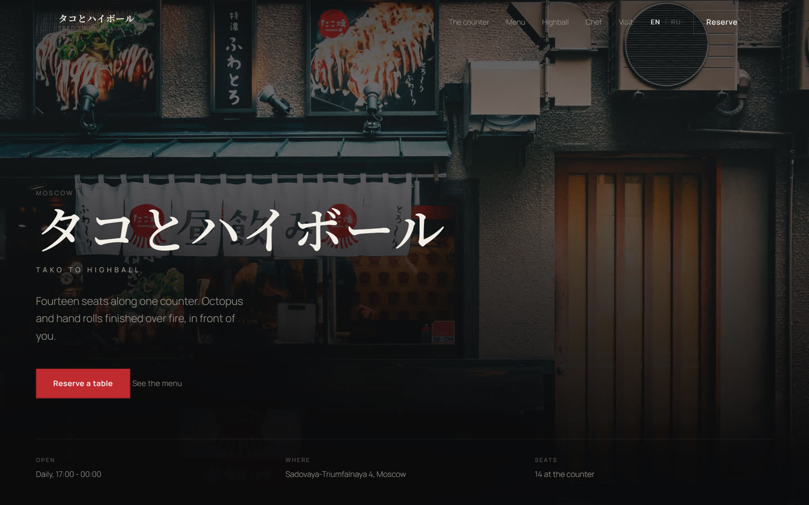
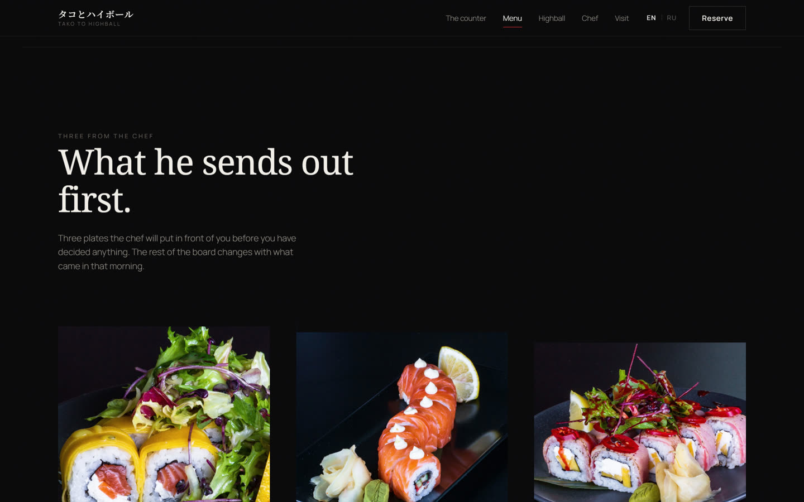
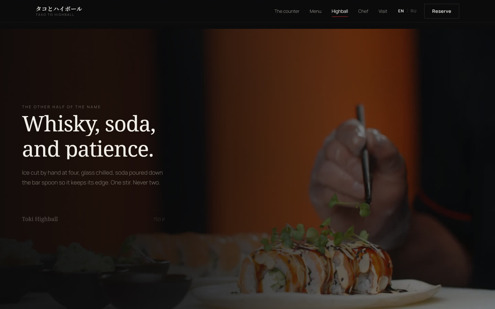
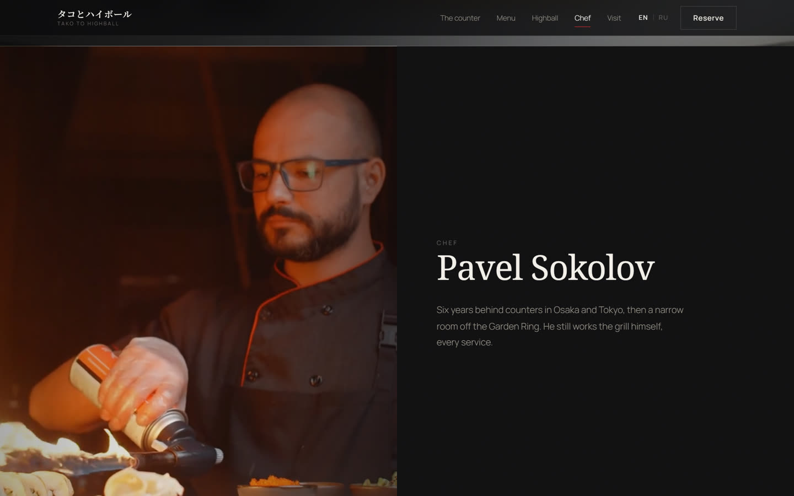
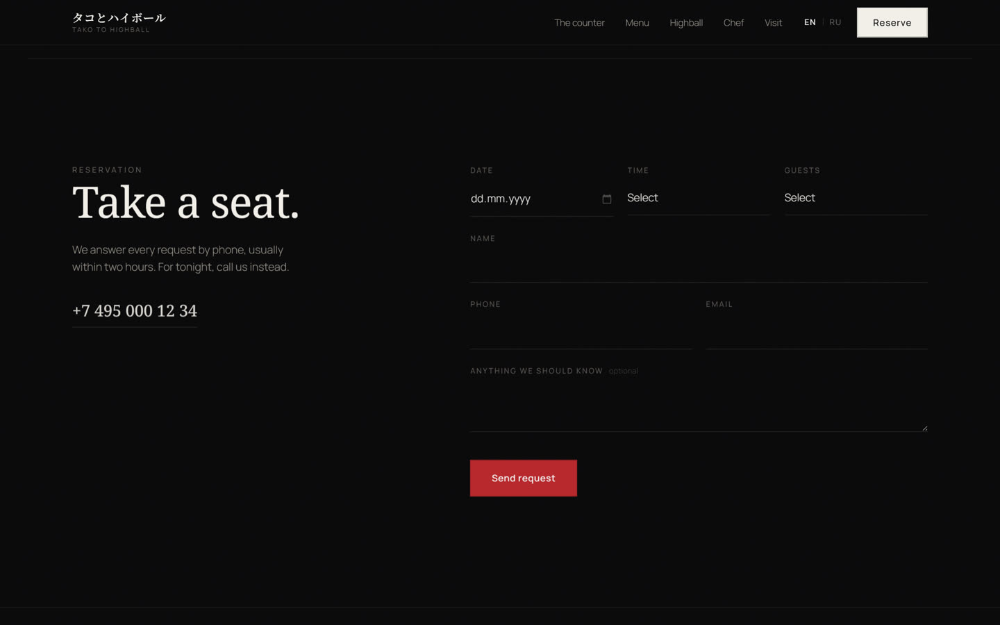

# タコとハイボール — Tako to Highball

**[Живая версия](https://bringto-dot.github.io/japanese-restaurant-landing/)**

*[Read in English](README.md)*

Одностраничный сайт ресторана, сделанный как проект в портфолио, чтобы
попрактиковаться и показать фронтенд-навыки за пределами шаблона: вёрстку,
анимации, типографику, производительность и мультиязычность. Всё на чистых
HTML/CSS/JS, без фреймворка и без сборки.

Ресторан, шеф, меню и адрес — вымышленные. Фото фасада и три фото блюд —
настоящие стоковые фотографии, использованные как контент, под который
проектировался сайт.



## Что показывает этот проект

- **Вёрстка и типографика.** Секция шефа с закреплённым видео и прокручивающимся
  текстом, сплит из двух фото для философии, редакторская сетка 3-в-ряд для
  меню, полноэкранный видео-момент для напитков. Ни один раздел не повторяет
  раскладку другого. Alegreya (серифный) и Manrope (гротеск) одинаково хорошо
  держат и английский, и русский — без шрифтов-заменителей.
- **Анимации по делу, а не для красоты.** Заголовки выезжают из-под собственного
  края (`.mask`, оборачивается в рантайме в `js/main.js`). Фото и видео
  открываются шторкой, которая поднимается, пока кадр одновременно выходит из
  лёгкого приближения — вместо обычного fade. Всё построено на
  `IntersectionObserver` и CSS-переходах/`animation-timeline`, нигде нет
  слушателя `scroll`, и всё сворачивается в статичную страницу при
  `prefers-reduced-motion`.
- **Настоящая мультиязычность, не плагин.** Каждая строка существует в обоих
  языках через `data-i18n-en` / `data-i18n-ru`; переключатель в шапке меняет
  `innerHTML` и запоминает выбор. Вёрстка не ломается, шрифт не меняется на
  кривой при переключении на кириллицу.
- **Производительность как условие, а не довесок.** Все три видео пережаты
  (H.264, ограниченная ширина, faststart, без звука — он и не нужен, всё
  беззвучное), и подключаются только когда их секция вот-вот попадёт в
  область видимости. Весь медиаконтент страницы — меньше 10 МБ, и при первой
  отрисовке грузится только фото фасада.
- **Фронтенд, который ведёт себя как с бэкендом.** Форма брони валидирует
  поля, не даёт выбрать прошедшую дату и показывает подтверждение при
  отправке, хотя на сервере ничего не подключено (это явно указано ниже, а не
  спрятано).

## Экраны

| | |
|---|---|
|  |  |
|  |  |

## Стек

Чистые HTML, CSS и JavaScript. Без фреймворка, без сборки, без зависимостей.
`dev-server.py` — небольшой локальный сервер с поддержкой HTTP Range,
нужен только потому, что встроенный `http.server` в Python не умеет отдавать
видео по частям для перемотки.

```bash
python dev-server.py 8080
```

## На заметку тем, кто смотрит код

- У формы брони нет бэкенда. При отправке она показывает подтверждение на
  клиенте; чтобы подключить реальный сервер, достаточно заменить обработчик
  `submit` в `js/main.js`.
- Все бизнес-данные (название, шеф, адрес, цены) — вымышленные, для
  цельного вымышленного концепта, а не описание настоящего места.
